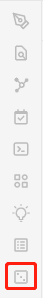
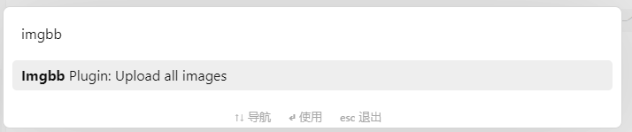
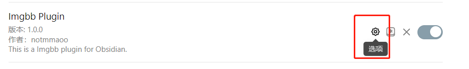
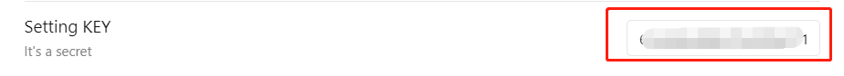

# Obsidian Imgbb Plugin

This plugin uploads images to Imgbb for Obsidian.

This project started with [obsidian-sample-plugin](https://github.com/obsidianmd/obsidian-sample-plugin)template.
The main reference is [obsidian-image-auto-upload-plugin](https://github.com/renmu123/obsidian-image-auto-upload-plugin)project's code.
Unlike `obsidian-image-auto-upload-plugin`, PicGo does not need to be installed to use this plugin.

**Note:** This project is a few hours to build the completion of the code is mostly cobbled together, do not have reference.

## Getting Started

1. Install the plugin and enable it, The plugin will add an icon :`Imgbb Plugin Icon` to the Ribbon section.
2. Configure the API Key for `imgbb` in the settings page ; Reference: https://api.imgbb.com/
3. Open a note that containing a `local-image-links`.
4. Click `Imgbb Plugin Icon`, The plugin will parse all `local-image-links` and upload them to `imgbb`.
  a. Alternative, you can also use the command "imgbb plugin: upload all images"
5. There is a Notice during and after the upload process.
6. If the upload is successful, the plugin will replace `local-image-link` with `remote-image-url`.

### Imgbb Plugin Icon

### Imgbb Plugin Command: upload all images

### Imgbb Plugin Setting

## Known Issues

1. After uploading to `imgbb`, the image is always displayed as a thumbnail, regardless of whether it uses `display_url` or `thumb.url` returned by the API.